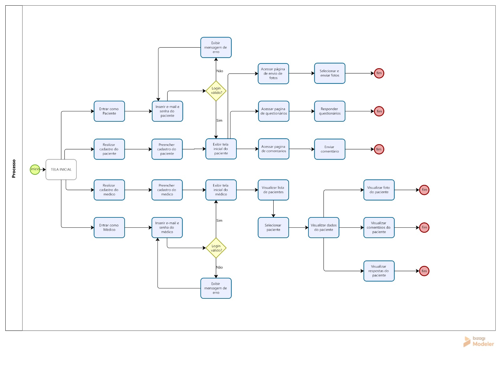

# Projeto de Interface

As interfaces foram desenvolvidas com foco na simplicidade e usabilidade, atendendo aos requisitos funcionais definidos, como registro de informações, envio de fotos e acompanhamento pelo médico.

Além disso, o sistema foi projetado para ser responsivo e de fácil navegação, atendendo aos requisitos não funcionais e às necessidades descritas nas histórias de usuário.

A estrutura das telas foi organizada de acordo com os diferentes perfis de acesso (paciente e médico), garantindo que cada usuário tenha acesso apenas às funcionalidades relevantes ao seu papel. O fluxo de navegação foi definido de forma intuitiva, iniciando pela tela principal e direcionando o usuário para ações como cadastro, login e acesso às funcionalidades do sistema.

Dessa forma, o projeto de interface busca proporcionar uma experiência clara, objetiva e eficiente, facilitando o acompanhamento pós-operatório e a comunicação entre paciente e médico.

## User Flow

O fluxograma a seguir representa o fluxo de navegação do sistema, demonstrando as interações entre pacientes e médicos, desde o acesso inicial até as funcionalidades de acompanhamento pós-operatório.

||
|:--------------------------------:|
|  **Fluxo do Usuário (User Flow)**    |

## Wireframes

### Tela 1A 
||
|:---------------------------:|
|       **Tela de Login**      |

| **Componente**               | **Requisitos Atendidos** |
|------------------------------|--------------------------|
| **Tela de Login** | RF-08: Permitir login de pacientes e médicos no sistema.|

### Tela 2A 
||
|:---------------------------:|
|       **Cadastro de Paciente**      |

| **Componente**               | **Requisitos Atendidos** |
|------------------------------|--------------------------|
| **Cadastro de Paciente** | RF-01:	Permitir cadastro de pacientes no sistema.|

### Tela 2B
||
|:---------------------------:|
|       **Login de Medico**      |

| **Componente**               | **Requisitos Atendidos** |
|------------------------------|--------------------------|
| **Login de Medico** | RF-07: Permitir cadastro de médicos no sistema.|

### Tela 3A 
||
|:---------------------------:|
|       **Dashboard do Paciente**      |

| **Componente**               | **Requisitos Atendidos** |
|------------------------------|--------------------------|
| **Dashboard do Paciente** | RF-09:	Permitir que o paciente visualize seu histórico de registros durante o pós-operatório.   RF-11: Permita que o paciente edite informações registradas no mesmo dia.   RF-13: Tela principal do paciente, contendo acesso e direcionamento para as demais funcionalidades do sistema.|

### Tela 3B 
||
|:---------------------------:|
|       **Dashboard do Médico**      |

| **Componente**               | **Requisitos Atendidos** |
|------------------------------|--------------------------|
| **Dashboard do Médico** | RF-14:	Tela principal do médico, contendo acesso e direcionamento para as demais funcionalidades do sistema.|

### Tela 4A — Questionário Diário
||
|:---------------------------:|
|       **Questionário Diário**      |

| **Componente**               | **Requisitos Atendidos** |
|------------------------------|--------------------------|
| **Questionário Diário** | RF-02:	Permitir que o paciente registre informações diárias sobre o pós-operatório.   RF-15: Tela de questionários diários destinados aos pacientes, contendo perguntas relacionadas ao tratamento realizado.| 

### Tela 4B
||
|:---------------------------:|
|       **Envio de Fotos**      |

| **Componente**               | **Requisitos Atendidos** |
|------------------------------|--------------------------|
| **Envio de Fotos** | RF-03:	permitir o envio de fotos da área transplantada.|

### Tela 4C 
||
|:---------------------------:|
|       **Registro de Dúvidas/Comentários**      |

| **Componente**               | **Requisitos Atendidos** |
|------------------------------|--------------------------|
| **Registro de Dúvidas/Comentários** | RF-12:	Permitir envio de comentários ou mensagens entre pacientes e médicos no sistema.   RF-16: Tela para registro de dúvidas, comentários e envio de fotos, com o objetivo de auxiliar o paciente durante o tratamento.|

### Tela 4D 
||
|:---------------------------:|
|       **Lista de Pacientes**      |

| **Componente**               | **Requisitos Atendidos** |
|------------------------------|--------------------------|
| **Lista de Pacientes** | RF-10:	Permitir que o médico filtre pacientes por dados da cirurgia ou nome.|

### Tela 4E 
||
|:---------------------------:|
|       **Detalhes do Paciente**      |

| **Componente**               | **Requisitos Atendidos** |
|------------------------------|--------------------------|
| **Detalhes do Paciente** | RF-05:	Exibir resumo da evolução do paciente durante o pós-operatório.   	RF-04: Permita que o médico visualize as informações registradas pelos pacientes.   RF-06: Permitir exportação do histórico de acompanhamento do paciente em relatório.| 

### Tela 4F 
||
|:---------------------------:|
|       **Visualização de Fotos**      |

| **Componente**               | **Requisitos Atendidos** |
|------------------------------|--------------------------|
| **Visualização de Fotos** | RF-17:	Tela destinada ao registro de fotos do paciente para acompanhamento e avaliação médica contínua.|
