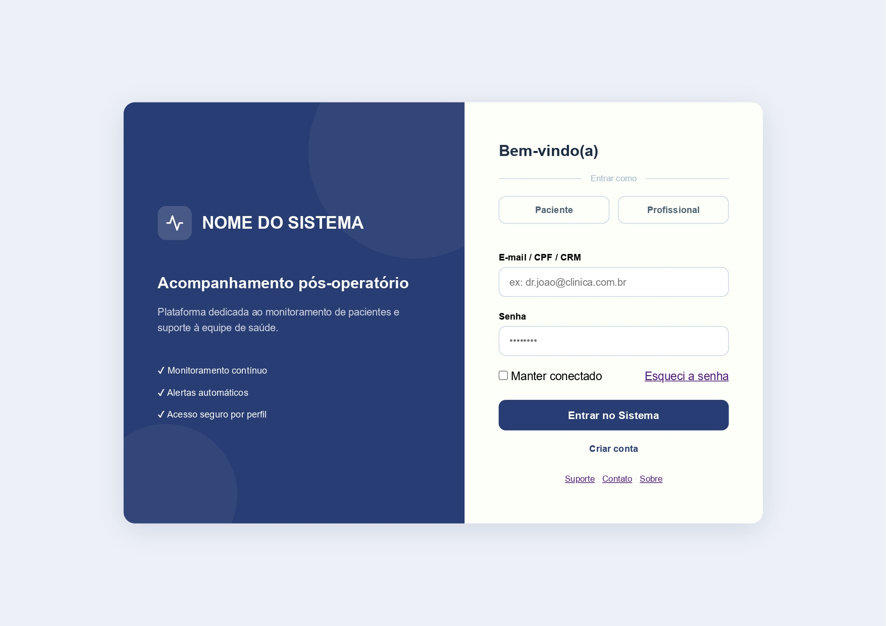
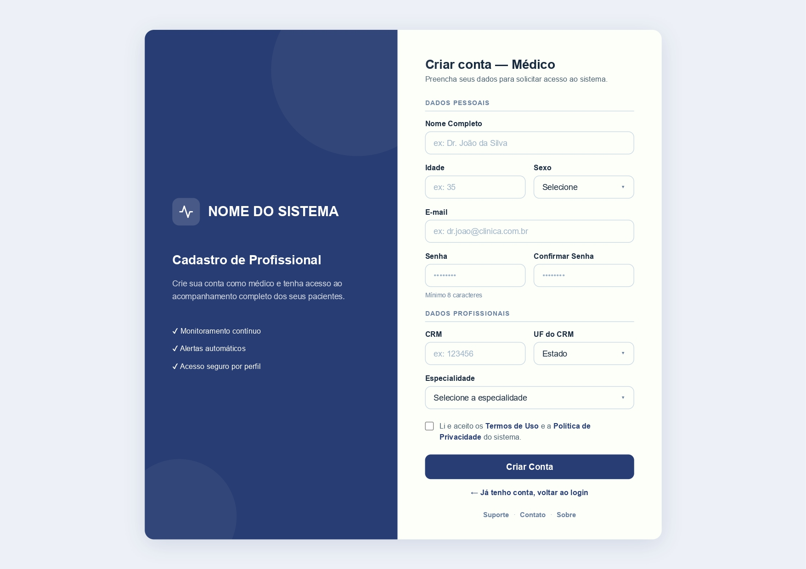
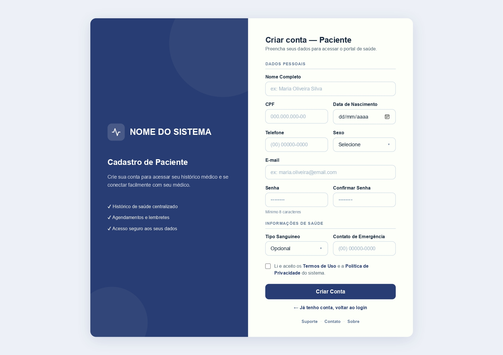
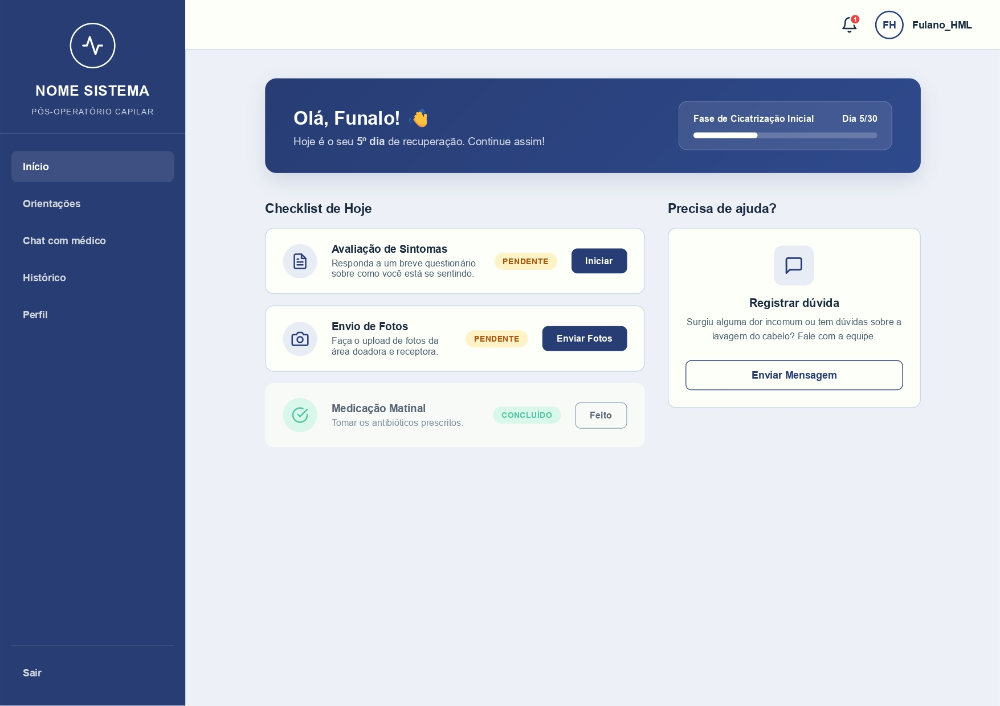
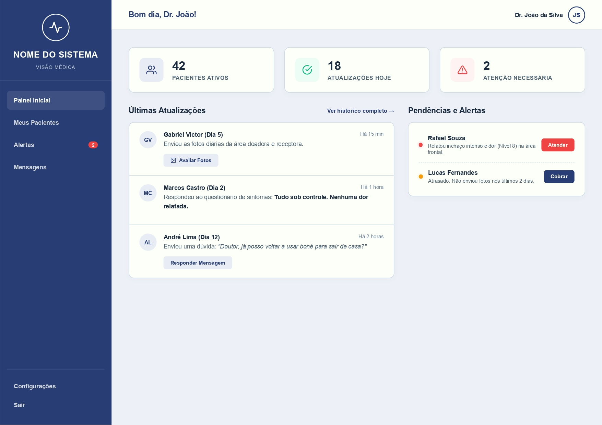
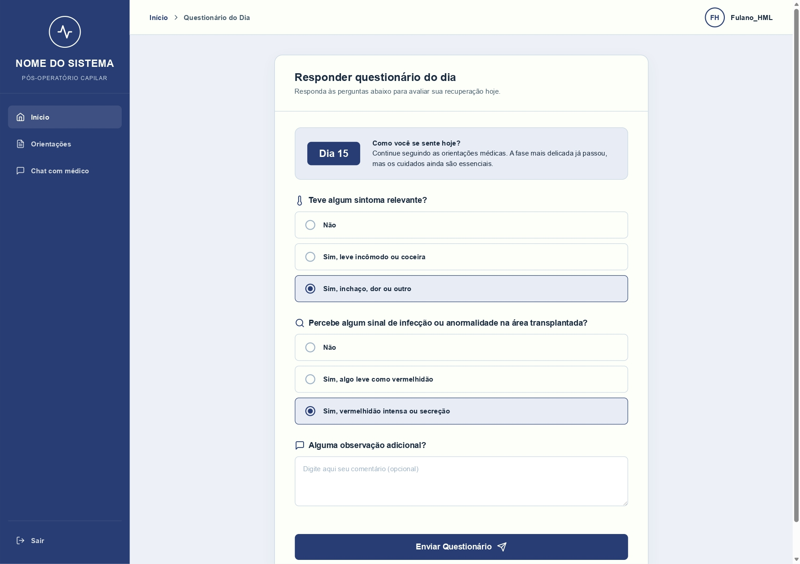
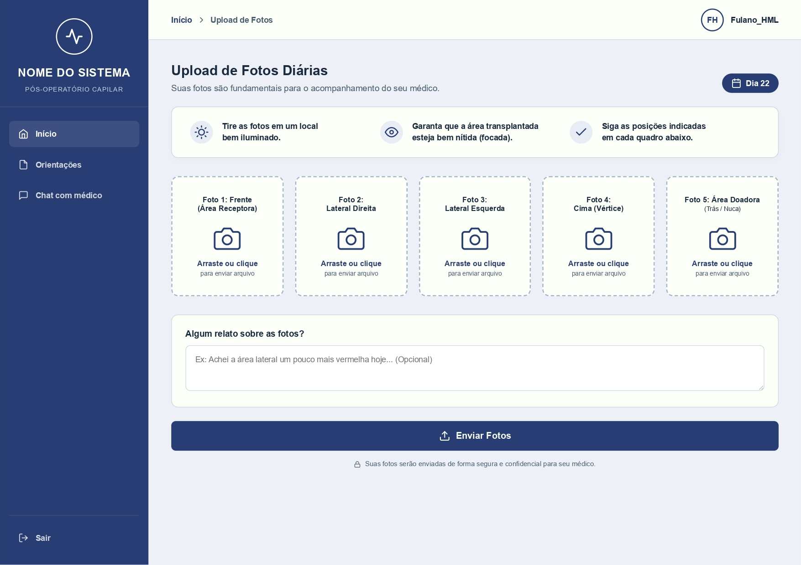
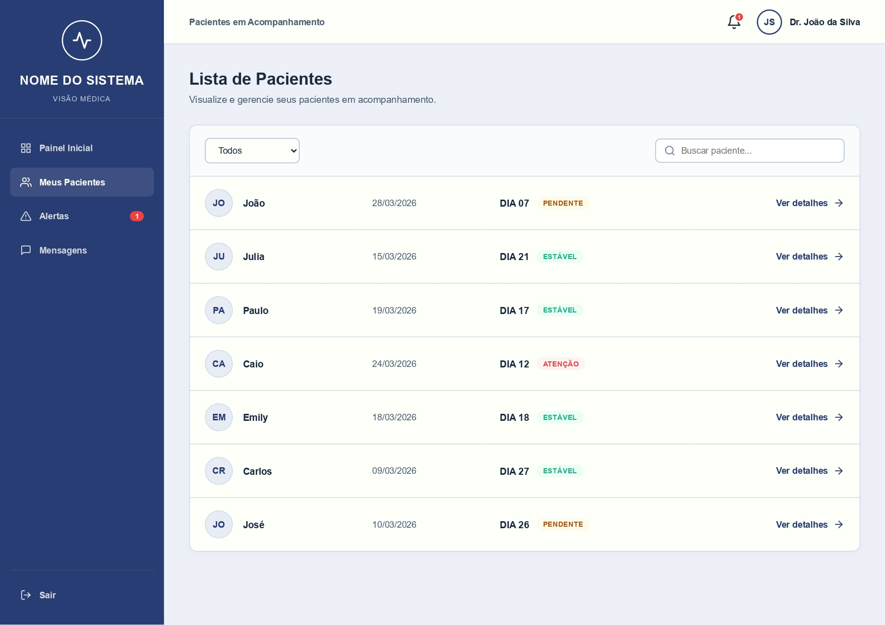
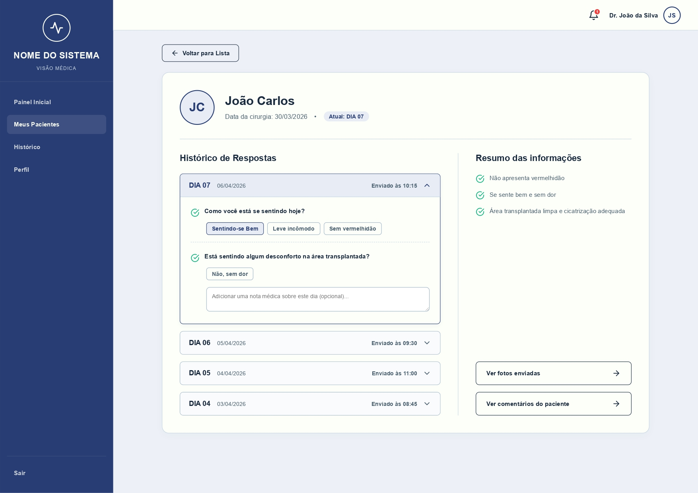
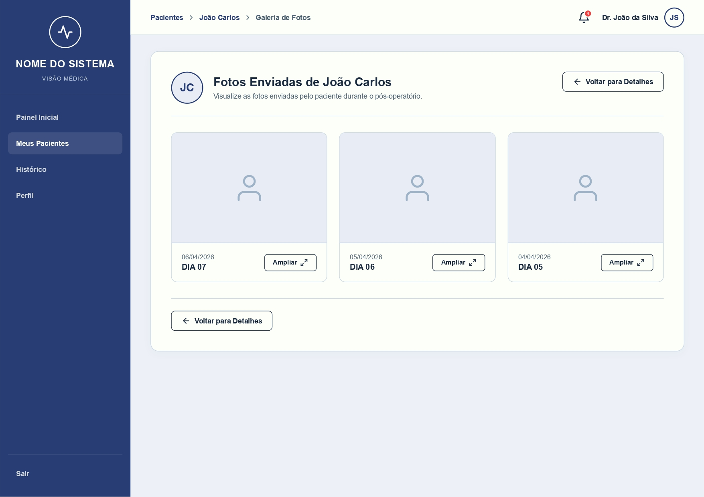

# Template padrão do site

O sistema foi desenvolvido utilizando um layout padrão baseado em HTML e CSS, com foco em usabilidade, organização das informações e experiência do usuário. Todas as páginas seguem um mesmo padrão visual, garantindo consistência na navegação e facilitando o uso tanto por pacientes quanto por médicos.

O layout é responsivo, permitindo acesso por diferentes dispositivos como computadores, tablets e smartphones. Além disso, foram utilizados elementos visuais simples e intuitivos para facilitar a interação com o sistema.

---

## Design

O design do sistema foi construído com base em uma estrutura lateral fixa (sidebar) e uma área principal de conteúdo.

- O **logo do sistema** está posicionado na parte superior da barra lateral esquerda.
- O menu lateral contém as principais funcionalidades, como:
  - Início
  - Orientações
  - Chat com médico
  - Histórico
  - Perfil
- A área principal da tela apresenta os conteúdos dinâmicos, como:
  - Questionários
  - Upload de fotos
  - Listagem de pacientes
  - Informações clínicas

Os layouts foram projetados para serem limpos, organizados e com foco na leitura fácil das informações.

---

## Cores

A paleta de cores do sistema foi escolhida com base em tons sóbrios e relacionados à área da saúde, transmitindo confiança e segurança ao usuário.

Principais cores utilizadas:

- Azul escuro: utilizado na barra lateral e elementos principais  
- Azul claro: utilizado em destaques e botões  
- Branco: utilizado como fundo principal  
- Cinza claro: utilizado em caixas de conteúdo  
- Verde: indica status positivo (ex: concluído)  
- Vermelho: indica alertas ou problemas  

Essa combinação garante boa legibilidade e diferenciação visual das informações.

---

## Tipografia

Foram utilizadas fontes simples e modernas, visando legibilidade e clareza.

Funções da tipografia no sistema:

- **Título de página:** fonte maior e em negrito  
- **Títulos de seção:** tamanho médio, com destaque visual  
- **Rótulos de componentes:** utilizados em formulários e campos  
- **Corpo de texto:** fonte padrão, com fácil leitura  

A tipografia foi aplicada de forma consistente em todas as telas.

---

## Iconografia

Os ícones utilizados no sistema têm o objetivo de facilitar a compreensão das funcionalidades e melhorar a experiência do usuário.

Principais ícones utilizados:

- Ícone de usuário: identificação de perfil  
- Ícone de câmera: envio de fotos  
- Ícone de mensagem: comunicação com médico  
- Ícone de alerta: indicação de problemas  
- Ícone de check: tarefas concluídas  

Os ícones são simples, intuitivos e seguem um padrão visual consistente.

---

## Estilos CSS

Os estilos CSS foram definidos para garantir padronização visual e boa usabilidade.

Principais definições:

- Layout com sidebar fixa à esquerda  
- Botões com cores destacadas e bordas arredondadas  
- Cards para organização das informações  
- Espaçamento adequado entre elementos  
- Responsividade para diferentes tamanhos de tela  

Esses estilos contribuem para uma interface organizada, moderna e fácil de utilizar.

---

## Telas do Template

### Tela 1 — Login

### Tela 2 — Cadastro Médico

### Tela 3 — Cadastro Paciente

### Tela 4 — Dashboard Paciente

### Tela 5 — Questionário Diário

### Tela 6 — Upload de Fotos

### Tela 7 — Dashboard Médico

### Tela 8 — Lista de Pacientes

### Tela 9 — Detalhes do Paciente

### Tela 10 — Galeria de Fotos

